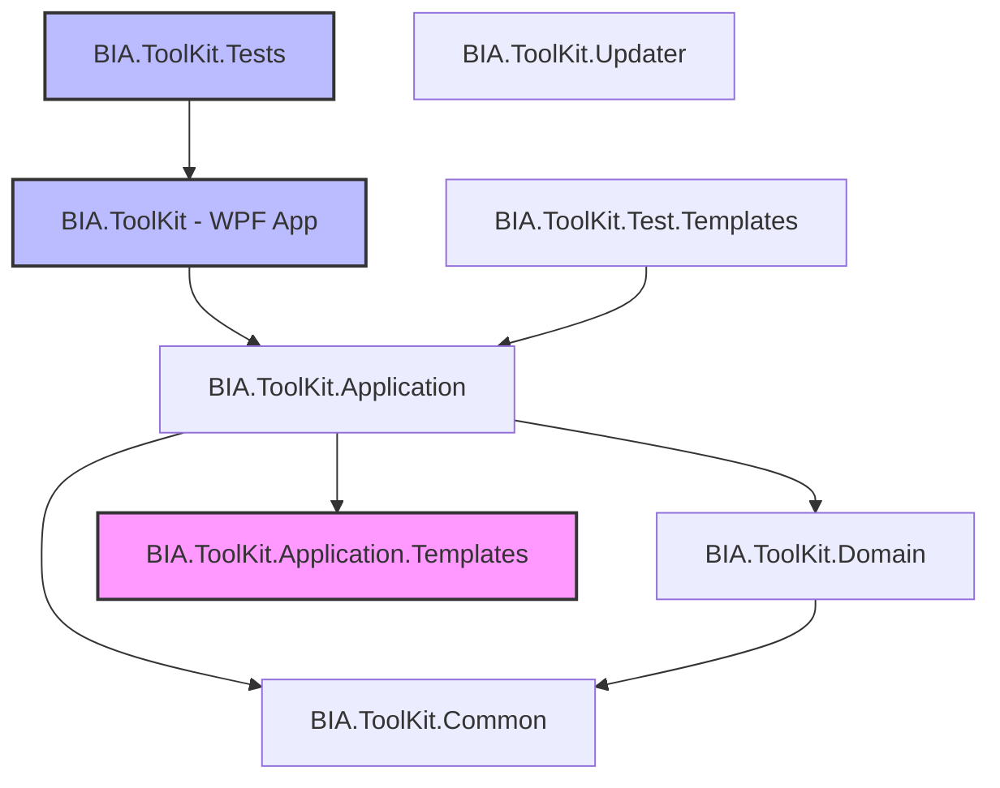
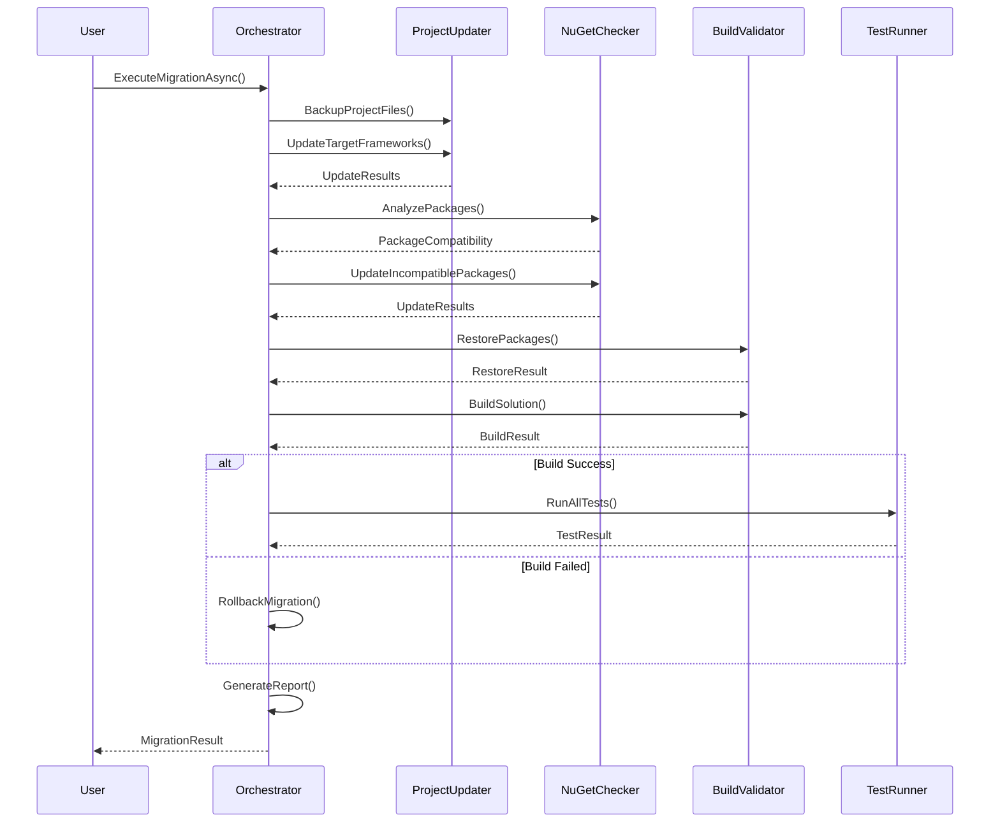

# Design Document: Migration .NET 10 de BIA.ToolKit

## Overview

Ce document détaille l'architecture technique pour la migration de BIA.ToolKit de .NET 9 vers .NET 10. La solution comprend 8 projets, dont 7 doivent être migrés vers .NET 10 et 1 (BIA.ToolKit.Application.Templates) doit rester en .NET Framework 4.8 pour maintenir la compatibilité avec les templates T4.

### Objectifs de la migration

- Migrer les Target Frameworks de net9.0 vers net10.0 pour les projets .NET Core
- Migrer les Target Frameworks de net9.0-windows10.0.19041.0 vers net10.0-windows10.0.19041.0 pour les projets WPF
- Préserver la compatibilité du projet de templates T4 en .NET Framework 4.8
- Vérifier et mettre à jour les packages NuGet pour la compatibilité .NET 10
- Garantir que la solution compile et que tous les tests passent après migration
- Maintenir la fonctionnalité complète de l'application WPF

### Portée de la migration

**Projets à migrer vers .NET 10:**
1. BIA.ToolKit.csproj (net9.0-windows10.0.19041.0 → net10.0-windows10.0.19041.0)
2. BIA.ToolKit.Application.csproj (net9.0 → net10.0)
3. BIA.ToolKit.Common.csproj (net9.0 → net10.0)
4. BIA.ToolKit.Domain.csproj (net9.0 → net10.0)
5. BIA.ToolKit.Updater.csproj (net9.0 → net10.0)
6. BIA.ToolKit.Test.Templates.csproj (net9.0 → net10.0)
7. BIA.ToolKit.Tests.csproj (net9.0-windows10.0.19041.0 → net10.0-windows10.0.19041.0)

**Projet à préserver en .NET Framework 4.8:**
- BIA.ToolKit.Application.Templates.csproj (v4.8 - inchangé)

## Architecture

### Architecture de la solution



### Stratégie de migration

La migration suivra une approche bottom-up pour minimiser les risques:

1. **Phase 1: Projets de base** - Migrer les projets sans dépendances (Common, Domain)
2. **Phase 2: Couche application** - Migrer Application (qui dépend de Common, Domain, et Templates)
3. **Phase 3: Projets exécutables** - Migrer les projets WPF et console (ToolKit, Updater)
4. **Phase 4: Projets de test** - Migrer les projets de test
5. **Phase 5: Validation** - Compilation, tests, et validation fonctionnelle

### Gestion de la compatibilité T4

Le projet BIA.ToolKit.Application.Templates reste en .NET Framework 4.8 car:
- Les templates T4 (.tt files) nécessitent le moteur T4 de .NET Framework
- Le package Mono.TextTemplating utilisé dans BIA.ToolKit.Application gère l'exécution des templates
- La référence de projet cross-framework (net10.0 → net48) est supportée par MSBuild

## Components and Interfaces

### Migration System Components

#### 1. ProjectFileUpdater

Responsable de la mise à jour des fichiers .csproj.

```csharp
public interface IProjectFileUpdater
{
    /// <summary>
    /// Met à jour le TargetFramework dans un fichier .csproj
    /// </summary>
    Task<UpdateResult> UpdateTargetFrameworkAsync(
        string projectPath, 
        string newTargetFramework);
    
    /// <summary>
    /// Vérifie si un projet doit être migré
    /// </summary>
    bool ShouldMigrate(string projectPath);
    
    /// <summary>
    /// Sauvegarde une copie du fichier avant modification
    /// </summary>
    Task BackupProjectFileAsync(string projectPath);
}

public class UpdateResult
{
    public bool Success { get; set; }
    public string ProjectPath { get; set; }
    public string OldTargetFramework { get; set; }
    public string NewTargetFramework { get; set; }
    public List<string> Errors { get; set; }
}
```

#### 2. NuGetCompatibilityChecker

Vérifie la compatibilité des packages NuGet avec .NET 10.

```csharp
public interface INuGetCompatibilityChecker
{
    /// <summary>
    /// Vérifie la compatibilité d'un package avec .NET 10
    /// </summary>
    Task<CompatibilityResult> CheckPackageCompatibilityAsync(
        string packageId, 
        string currentVersion);
    
    /// <summary>
    /// Obtient la version minimale compatible avec .NET 10
    /// </summary>
    Task<string> GetMinimumCompatibleVersionAsync(
        string packageId);
    
    /// <summary>
    /// Analyse tous les packages d'un projet
    /// </summary>
    Task<List<PackageCompatibility>> AnalyzeProjectPackagesAsync(
        string projectPath);
}

public class PackageCompatibility
{
    public string PackageId { get; set; }
    public string CurrentVersion { get; set; }
    public bool IsCompatible { get; set; }
    public string MinimumCompatibleVersion { get; set; }
    public string RecommendedVersion { get; set; }
}
```

#### 3. BuildValidator

Valide que la solution compile après migration.

```csharp
public interface IBuildValidator
{
    /// <summary>
    /// Compile la solution complète
    /// </summary>
    Task<BuildResult> BuildSolutionAsync(string solutionPath);
    
    /// <summary>
    /// Compile un projet spécifique
    /// </summary>
    Task<BuildResult> BuildProjectAsync(string projectPath);
    
    /// <summary>
    /// Restaure les packages NuGet
    /// </summary>
    Task<RestoreResult> RestorePackagesAsync(string solutionPath);
}

public class BuildResult
{
    public bool Success { get; set; }
    public List<BuildError> Errors { get; set; }
    public List<BuildWarning> Warnings { get; set; }
    public TimeSpan Duration { get; set; }
}

public class BuildError
{
    public string FilePath { get; set; }
    public int LineNumber { get; set; }
    public string ErrorCode { get; set; }
    public string Message { get; set; }
}
```

#### 4. TestRunner

Exécute les tests après migration.

```csharp
public interface ITestRunner
{
    /// <summary>
    /// Exécute tous les tests d'un projet
    /// </summary>
    Task<TestResult> RunTestsAsync(string testProjectPath);
    
    /// <summary>
    /// Exécute tous les tests de la solution
    /// </summary>
    Task<TestResult> RunAllTestsAsync(string solutionPath);
}

public class TestResult
{
    public int TotalTests { get; set; }
    public int PassedTests { get; set; }
    public int FailedTests { get; set; }
    public int SkippedTests { get; set; }
    public List<TestFailure> Failures { get; set; }
    public TimeSpan Duration { get; set; }
}

public class TestFailure
{
    public string TestName { get; set; }
    public string ErrorMessage { get; set; }
    public string StackTrace { get; set; }
}
```

#### 5. MigrationOrchestrator

Orchestre le processus complet de migration.

```csharp
public interface IMigrationOrchestrator
{
    /// <summary>
    /// Exécute la migration complète
    /// </summary>
    Task<MigrationResult> ExecuteMigrationAsync(
        string solutionPath, 
        MigrationOptions options);
    
    /// <summary>
    /// Annule la migration et restaure les fichiers de backup
    /// </summary>
    Task RollbackMigrationAsync(string solutionPath);
    
    /// <summary>
    /// Génère un rapport de migration
    /// </summary>
    Task<MigrationReport> GenerateReportAsync(
        MigrationResult result);
}

public class MigrationOptions
{
    public bool UpdateNuGetPackages { get; set; }
    public bool RunTests { get; set; }
    public bool CreateBackup { get; set; }
    public bool ValidateBuild { get; set; }
}

public class MigrationResult
{
    public bool Success { get; set; }
    public List<UpdateResult> ProjectUpdates { get; set; }
    public List<PackageCompatibility> PackageUpdates { get; set; }
    public BuildResult BuildResult { get; set; }
    public TestResult TestResult { get; set; }
    public List<string> Errors { get; set; }
    public List<string> Warnings { get; set; }
}
```

### Workflow de migration



## Data Models

### Project Configuration Model

```csharp
public class ProjectConfiguration
{
    public string ProjectPath { get; set; }
    public string ProjectName { get; set; }
    public string CurrentTargetFramework { get; set; }
    public string TargetTargetFramework { get; set; }
    public bool ShouldMigrate { get; set; }
    public List<PackageReference> PackageReferences { get; set; }
    public List<ProjectReference> ProjectReferences { get; set; }
}

public class PackageReference
{
    public string PackageId { get; set; }
    public string Version { get; set; }
    public List<string> ExcludeAssets { get; set; }
    public List<string> IncludeAssets { get; set; }
}

public class ProjectReference
{
    public string ProjectPath { get; set; }
    public string ProjectName { get; set; }
    public string TargetFramework { get; set; }
}
```

### Migration Configuration

```csharp
public class MigrationConfiguration
{
    public string SolutionPath { get; set; }
    public List<ProjectConfiguration> Projects { get; set; }
    public Dictionary<string, string> FrameworkMappings { get; set; }
    public List<PackageUpdateRule> PackageUpdateRules { get; set; }
}

public class PackageUpdateRule
{
    public string PackageId { get; set; }
    public string MinimumVersion { get; set; }
    public string RecommendedVersion { get; set; }
    public bool RequiresUpdate { get; set; }
}
```

### Target Framework Mappings

```csharp
public static class FrameworkMappings
{
    public static readonly Dictionary<string, string> Net9ToNet10 = new()
    {
        { "net9.0", "net10.0" },
        { "net9.0-windows10.0.19041.0", "net10.0-windows10.0.19041.0" }
    };
    
    public static readonly HashSet<string> PreservedFrameworks = new()
    {
        "v4.8",  // .NET Framework 4.8
        "net48"
    };
}
```

### Package Compatibility Database

Les packages actuellement utilisés et leur compatibilité .NET 10:

| Package | Version actuelle | Compatible .NET 10 | Version recommandée |
|---------|------------------|-------------------|---------------------|
| MaterialDesignThemes | 5.2.1 | ✅ Oui | 5.2.1 |
| Microsoft.Build.Tasks.Core | 17.14.28 | ✅ Oui | 17.14.28 |
| Microsoft.Extensions.DependencyInjection | 9.0.6 | ⚠️ Mise à jour | 10.0.0 |
| Microsoft.Xaml.Behaviors.Wpf | 1.1.135 | ✅ Oui | 1.1.135 |
| Newtonsoft.Json | 13.0.3 | ✅ Oui | 13.0.3 |
| WpfAnimatedGif | 2.0.2 | ✅ Oui | 2.0.2 |
| LibGit2Sharp | 0.31.0 | ✅ Oui | 0.31.0 |
| Microsoft.Build.Locator | 1.9.1 | ✅ Oui | 1.9.1 |
| Microsoft.CodeAnalysis.CSharp.Workspaces | 4.14.0 | ⚠️ Mise à jour | 4.15.0 |
| Microsoft.CodeAnalysis.Workspaces.MSBuild | 4.14.0 | ⚠️ Mise à jour | 4.15.0 |
| Mono.TextTemplating | 3.0.0 | ✅ Oui | 3.0.0 |
| Octokit | 14.0.0 | ✅ Oui | 14.0.0 |
| Humanizer.Core | 2.14.1 | ✅ Oui | 2.14.1 |
| Microsoft.CodeAnalysis.CSharp | 4.14.0 | ⚠️ Mise à jour | 4.15.0 |
| xunit | 2.9.0 / 2.9.3 | ✅ Oui | 2.9.3 |
| FluentAssertions | 6.12.0 | ✅ Oui | 6.12.0 |
| FsCheck | 2.16.6 | ✅ Oui | 2.16.6 |
| Moq | 4.20.72 | ✅ Oui | 4.20.72 |


## Correctness Properties

*Une propriété est une caractéristique ou un comportement qui doit être vrai pour toutes les exécutions valides d'un système - essentiellement, une déclaration formelle de ce que le système doit faire. Les propriétés servent de pont entre les spécifications lisibles par l'homme et les garanties de correction vérifiables par machine.*

### Property Reflection

Après analyse des critères d'acceptation, plusieurs propriétés redondantes ont été identifiées:

**Redondances identifiées:**
- Critères 1.1-1.8: Tous testent la même règle de mise à jour de framework sur différents fichiers → Combinés en Property 1
- Critère 2.1: Redondant avec la propriété combinée ci-dessus
- Critères 5.1-5.2: Exemples spécifiques de l'exécution des tests → Couverts par les tests unitaires
- Critères 7.1-7.4: Tous testent la documentation des changements → Combinés en Property 7

**Propriétés finales retenues:**
- Property 1: Mise à jour correcte des Target Frameworks selon les règles de mapping
- Property 2: Préservation des références de projet
- Property 3: Vérification de compatibilité des packages NuGet
- Property 4: Identification des packages incompatibles
- Property 5: Mise à jour des packages incompatibles
- Property 6: Compilation réussie des projets migrés
- Property 7: Rapport des erreurs de compilation avec localisation
- Property 8: Rapport des résultats de tests
- Property 9: Rapport des échecs de tests avec détails
- Property 10: Documentation complète des changements de migration

### Property 1: Mise à jour correcte des Target Frameworks

*Pour tout* fichier .csproj dans la solution, si son TargetFramework est "net9.0" ou "net9.0-windows10.0.19041.0", alors après migration il doit être respectivement "net10.0" ou "net10.0-windows10.0.19041.0", et si son TargetFrameworkVersion est "v4.8", il doit rester "v4.8".

**Validates: Requirements 1.1, 1.2, 1.3, 1.4, 1.5, 1.6, 1.7, 1.8, 2.1**

### Property 2: Préservation des références de projet

*Pour toute* référence de projet (ProjectReference) dans un fichier .csproj avant migration, cette même référence doit exister après migration avec le même chemin relatif.

**Validates: Requirements 2.3**

### Property 3: Vérification de compatibilité des packages

*Pour tout* package NuGet référencé dans un projet cible, le système de migration doit vérifier sa compatibilité avec .NET 10 et produire un résultat de compatibilité.

**Validates: Requirements 3.1**

### Property 4: Identification des packages incompatibles

*Pour tout* package NuGet incompatible avec .NET 10, le système de migration doit identifier le package et déterminer sa version minimale compatible.

**Validates: Requirements 3.2**

### Property 5: Mise à jour des packages incompatibles

*Pour tout* package NuGet incompatible avec .NET 10, après migration, la version du package dans le fichier .csproj doit être au moins égale à la version minimale compatible avec .NET 10.

**Validates: Requirements 3.3**

### Property 6: Compilation réussie après migration

*Pour tout* projet cible migré vers .NET 10, la compilation du projet doit réussir sans erreurs après la migration.

**Validates: Requirements 4.1**

### Property 7: Rapport des erreurs de compilation

*Pour toute* erreur de compilation rencontrée, le système de migration doit rapporter l'erreur avec le chemin du fichier et le numéro de ligne.

**Validates: Requirements 4.3**

### Property 8: Rapport des résultats de tests

*Pour tout* projet de test exécuté, le système de migration doit rapporter le nombre de tests passés et échoués.

**Validates: Requirements 5.3**

### Property 9: Rapport des échecs de tests avec détails

*Pour tout* test qui échoue, le système de migration doit rapporter le nom du test et la raison de l'échec.

**Validates: Requirements 5.4**

### Property 10: Documentation complète des changements

*Pour tout* changement effectué pendant la migration (TargetFramework, package NuGet, breaking change, ou workaround), le système doit générer une entrée de documentation correspondante dans le rapport de migration.

**Validates: Requirements 7.1, 7.2, 7.3, 7.4**

## Error Handling

### Stratégies de gestion d'erreurs

#### 1. Erreurs de lecture/écriture de fichiers

```csharp
public class FileOperationException : Exception
{
    public string FilePath { get; set; }
    public FileOperation Operation { get; set; }
    
    public FileOperationException(string filePath, FileOperation operation, Exception innerException)
        : base($"Failed to {operation} file: {filePath}", innerException)
    {
        FilePath = filePath;
        Operation = operation;
    }
}

public enum FileOperation
{
    Read,
    Write,
    Backup,
    Restore
}
```

**Stratégie:** 
- Créer des backups avant toute modification
- En cas d'erreur, restaurer automatiquement les backups
- Logger toutes les opérations de fichiers pour audit

#### 2. Erreurs de compatibilité NuGet

```csharp
public class PackageCompatibilityException : Exception
{
    public string PackageId { get; set; }
    public string CurrentVersion { get; set; }
    public string TargetFramework { get; set; }
    
    public PackageCompatibilityException(
        string packageId, 
        string currentVersion, 
        string targetFramework)
        : base($"Package {packageId} v{currentVersion} is not compatible with {targetFramework}")
    {
        PackageId = packageId;
        CurrentVersion = currentVersion;
        TargetFramework = targetFramework;
    }
}
```

**Stratégie:**
- Vérifier la compatibilité avant de modifier les fichiers
- Proposer des versions alternatives compatibles
- Permettre à l'utilisateur de choisir de continuer ou d'annuler

#### 3. Erreurs de compilation

```csharp
public class BuildFailedException : Exception
{
    public List<BuildError> Errors { get; set; }
    public string ProjectPath { get; set; }
    
    public BuildFailedException(string projectPath, List<BuildError> errors)
        : base($"Build failed for {projectPath} with {errors.Count} error(s)")
    {
        ProjectPath = projectPath;
        Errors = errors;
    }
}
```

**Stratégie:**
- Capturer toutes les erreurs de compilation avec leur localisation
- Grouper les erreurs par type pour faciliter le diagnostic
- Proposer un rollback automatique si la compilation échoue
- Générer un rapport détaillé des erreurs

#### 4. Erreurs de tests

```csharp
public class TestFailedException : Exception
{
    public List<TestFailure> Failures { get; set; }
    public string TestProjectPath { get; set; }
    
    public TestFailedException(string testProjectPath, List<TestFailure> failures)
        : base($"Tests failed in {testProjectPath}: {failures.Count} failure(s)")
    {
        TestProjectPath = testProjectPath;
        Failures = failures;
    }
}
```

**Stratégie:**
- Continuer l'exécution de tous les tests même si certains échouent
- Rapporter tous les échecs avec stack traces complètes
- Permettre à l'utilisateur de décider si les échecs sont bloquants
- Ne pas faire de rollback automatique sur échec de tests (décision utilisateur)

#### 5. Rollback Strategy

En cas d'erreur critique, le système doit pouvoir restaurer l'état initial:

```csharp
public interface IRollbackManager
{
    /// <summary>
    /// Crée un point de restauration avant migration
    /// </summary>
    Task<string> CreateRestorePointAsync(string solutionPath);
    
    /// <summary>
    /// Restaure tous les fichiers depuis le point de restauration
    /// </summary>
    Task RestoreFromPointAsync(string restorePointId);
    
    /// <summary>
    /// Nettoie les points de restauration après succès
    /// </summary>
    Task CleanupRestorePointAsync(string restorePointId);
}
```

**Conditions de rollback automatique:**
- Erreur de lecture/écriture de fichiers critiques
- Impossibilité de parser les fichiers .csproj
- Échec de compilation après migration (optionnel, selon configuration)

**Conditions de rollback manuel:**
- Échecs de tests (décision utilisateur)
- Problèmes de compatibilité NuGet non résolus
- Problèmes de fonctionnalité détectés manuellement

## Testing Strategy

### Approche de test duale

La stratégie de test combine des tests unitaires pour les cas spécifiques et des tests basés sur les propriétés pour la validation universelle.

#### Tests unitaires

Les tests unitaires se concentrent sur:
- Exemples spécifiques de migration de fichiers individuels
- Cas limites (edge cases) comme les fichiers corrompus ou malformés
- Intégration entre composants (ProjectUpdater → BuildValidator)
- Validation de la préservation du projet .NET Framework 4.8
- Vérification du lancement de l'application WPF

**Exemples de tests unitaires:**

```csharp
[Fact]
public async Task UpdateTargetFramework_BIAToolKitApplication_UpdatesToNet10()
{
    // Arrange
    var projectPath = "BIA.ToolKit.Application/BIA.ToolKit.Application.csproj";
    var updater = new ProjectFileUpdater();
    
    // Act
    var result = await updater.UpdateTargetFrameworkAsync(projectPath, "net10.0");
    
    // Assert
    result.Success.Should().BeTrue();
    result.NewTargetFramework.Should().Be("net10.0");
}

[Fact]
public async Task UpdateTargetFramework_TemplatesProject_RemainsUnchanged()
{
    // Arrange
    var projectPath = "BIA.ToolKit.Application.Templates/BIA.ToolKit.Application.Templates.csproj";
    var updater = new ProjectFileUpdater();
    
    // Act
    var shouldMigrate = updater.ShouldMigrate(projectPath);
    
    // Assert
    shouldMigrate.Should().BeFalse();
}

[Fact]
public async Task BuildValidator_LegacyProject_CompilesSuccessfully()
{
    // Arrange
    var validator = new BuildValidator();
    var projectPath = "BIA.ToolKit.Application.Templates/BIA.ToolKit.Application.Templates.csproj";
    
    // Act
    var result = await validator.BuildProjectAsync(projectPath);
    
    // Assert
    result.Success.Should().BeTrue();
    result.Errors.Should().BeEmpty();
}
```

#### Tests basés sur les propriétés (Property-Based Testing)

Les tests de propriétés utilisent FsCheck (déjà présent dans BIA.ToolKit.Tests) pour valider les propriétés universelles.

**Configuration:**
- Bibliothèque: FsCheck 2.16.6 (déjà installée)
- Itérations minimales: 100 par test
- Format de tag: **Feature: dotnet-10-migration, Property {number}: {property_text}**

**Exemples de tests de propriétés:**

```csharp
[Property(MaxTest = 100)]
public Property TargetFrameworkMapping_AllProjects_FollowsMappingRules()
{
    // Feature: dotnet-10-migration, Property 1: Mise à jour correcte des Target Frameworks
    
    return Prop.ForAll<ProjectConfiguration>(project =>
    {
        var updater = new ProjectFileUpdater();
        var result = updater.UpdateTargetFrameworkAsync(
            project.ProjectPath, 
            GetMappedFramework(project.CurrentTargetFramework)).Result;
        
        if (project.CurrentTargetFramework == "net9.0")
            return result.NewTargetFramework == "net10.0";
        else if (project.CurrentTargetFramework == "net9.0-windows10.0.19041.0")
            return result.NewTargetFramework == "net10.0-windows10.0.19041.0";
        else if (project.CurrentTargetFramework == "v4.8")
            return result.NewTargetFramework == "v4.8";
        else
            return true;
    });
}

[Property(MaxTest = 100)]
public Property ProjectReferences_AfterMigration_ArePreserved()
{
    // Feature: dotnet-10-migration, Property 2: Préservation des références de projet
    
    return Prop.ForAll<ProjectConfiguration>(project =>
    {
        var originalRefs = project.ProjectReferences.ToList();
        var orchestrator = new MigrationOrchestrator();
        
        orchestrator.ExecuteMigrationAsync(project.ProjectPath, new MigrationOptions()).Wait();
        
        var updatedProject = LoadProjectConfiguration(project.ProjectPath);
        var updatedRefs = updatedProject.ProjectReferences;
        
        return originalRefs.Count == updatedRefs.Count &&
               originalRefs.All(r => updatedRefs.Any(u => u.ProjectPath == r.ProjectPath));
    });
}

[Property(MaxTest = 100)]
public Property NuGetPackages_AllTargetProjects_CompatibilityVerified()
{
    // Feature: dotnet-10-migration, Property 3: Vérification de compatibilité des packages
    
    return Prop.ForAll<PackageReference>(package =>
    {
        var checker = new NuGetCompatibilityChecker();
        var result = checker.CheckPackageCompatibilityAsync(
            package.PackageId, 
            package.Version).Result;
        
        return result != null && 
               !string.IsNullOrEmpty(result.PackageId);
    });
}

[Property(MaxTest = 100)]
public Property IncompatiblePackages_AfterMigration_AreUpdated()
{
    // Feature: dotnet-10-migration, Property 5: Mise à jour des packages incompatibles
    
    return Prop.ForAll<PackageReference>(package =>
    {
        var checker = new NuGetCompatibilityChecker();
        var compatibility = checker.CheckPackageCompatibilityAsync(
            package.PackageId, 
            package.Version).Result;
        
        if (!compatibility.IsCompatible)
        {
            var orchestrator = new MigrationOrchestrator();
            orchestrator.ExecuteMigrationAsync(
                package.ProjectPath, 
                new MigrationOptions { UpdateNuGetPackages = true }).Wait();
            
            var updatedProject = LoadProjectConfiguration(package.ProjectPath);
            var updatedPackage = updatedProject.PackageReferences
                .FirstOrDefault(p => p.PackageId == package.PackageId);
            
            return updatedPackage != null &&
                   Version.Parse(updatedPackage.Version) >= 
                   Version.Parse(compatibility.MinimumCompatibleVersion);
        }
        
        return true;
    });
}

[Property(MaxTest = 100)]
public Property MigratedProjects_AfterMigration_CompileSuccessfully()
{
    // Feature: dotnet-10-migration, Property 6: Compilation réussie des projets migrés
    
    return Prop.ForAll<ProjectConfiguration>(project =>
    {
        if (!project.ShouldMigrate) return true;
        
        var orchestrator = new MigrationOrchestrator();
        orchestrator.ExecuteMigrationAsync(
            project.ProjectPath, 
            new MigrationOptions { ValidateBuild = true }).Wait();
        
        var validator = new BuildValidator();
        var buildResult = validator.BuildProjectAsync(project.ProjectPath).Result;
        
        return buildResult.Success && buildResult.Errors.Count == 0;
    });
}

[Property(MaxTest = 100)]
public Property CompilationErrors_WhenReported_IncludeFilePathAndLine()
{
    // Feature: dotnet-10-migration, Property 7: Rapport des erreurs de compilation
    
    return Prop.ForAll<BuildError>(error =>
    {
        return !string.IsNullOrEmpty(error.FilePath) &&
               error.LineNumber > 0 &&
               !string.IsNullOrEmpty(error.Message);
    });
}

[Property(MaxTest = 100)]
public Property TestResults_AfterExecution_ReportPassedAndFailedCounts()
{
    // Feature: dotnet-10-migration, Property 8: Rapport des résultats de tests
    
    return Prop.ForAll<TestResult>(result =>
    {
        return result.TotalTests == 
               (result.PassedTests + result.FailedTests + result.SkippedTests);
    });
}

[Property(MaxTest = 100)]
public Property FailedTests_WhenReported_IncludeNameAndReason()
{
    // Feature: dotnet-10-migration, Property 9: Rapport des échecs de tests
    
    return Prop.ForAll<TestFailure>(failure =>
    {
        return !string.IsNullOrEmpty(failure.TestName) &&
               !string.IsNullOrEmpty(failure.ErrorMessage);
    });
}

[Property(MaxTest = 100)]
public Property MigrationChanges_AfterMigration_AreDocumented()
{
    // Feature: dotnet-10-migration, Property 10: Documentation complète des changements
    
    return Prop.ForAll<MigrationResult>(result =>
    {
        var report = new MigrationOrchestrator().GenerateReportAsync(result).Result;
        
        // Tous les projets mis à jour doivent être documentés
        var allProjectsDocumented = result.ProjectUpdates
            .All(update => report.Contains(update.ProjectPath));
        
        // Tous les packages mis à jour doivent être documentés
        var allPackagesDocumented = result.PackageUpdates
            .Where(p => p.CurrentVersion != p.RecommendedVersion)
            .All(pkg => report.Contains(pkg.PackageId));
        
        return allProjectsDocumented && allPackagesDocumented;
    });
}
```

### Validation des propriétés

Chaque propriété doit être testée avec au moins 100 itérations pour garantir une couverture suffisante des cas possibles. Les générateurs FsCheck doivent être configurés pour produire:

- Configurations de projet valides avec différents Target Frameworks
- Références de packages avec versions variées
- Erreurs de compilation avec différents codes d'erreur
- Résultats de tests avec différentes combinaisons de succès/échec

## Testing Strategy

### Stratégie de test globale

La stratégie combine tests unitaires et tests de propriétés pour une couverture complète:

**Tests unitaires:**
- Validation de chaque fichier .csproj spécifique (7 projets à migrer + 1 à préserver)
- Tests d'intégration entre composants
- Tests de cas limites (fichiers corrompus, permissions insuffisantes)
- Tests de rollback et restauration
- Tests de génération de rapport
- Validation du lancement de l'application WPF

**Tests de propriétés (Property-Based Testing):**
- Validation des règles de mapping de frameworks (Property 1)
- Préservation des références de projet (Property 2)
- Vérification de compatibilité NuGet (Properties 3, 4, 5)
- Validation de compilation (Properties 6, 7)
- Validation des tests (Properties 8, 9)
- Documentation complète (Property 10)

### Configuration des tests

**Framework de test:** xUnit 2.9.3
**Property-based testing:** FsCheck 2.16.6
**Assertions:** FluentAssertions 6.12.0
**Mocking:** Moq 4.20.72

**Paramètres de test:**
- Itérations minimales par property test: 100
- Timeout par test: 30 secondes
- Parallélisation: Activée pour les tests unitaires, désactivée pour les tests de propriétés

### Validation manuelle

Certains aspects nécessitent une validation manuelle:
- Lancement et fonctionnement de l'application WPF
- Vérification visuelle de l'interface utilisateur
- Test des fonctionnalités de génération de code
- Validation de l'intégration avec les templates T4

### Critères de succès

La migration est considérée réussie si:
1. Tous les projets cibles sont migrés vers .NET 10
2. Le projet Templates reste en .NET Framework 4.8
3. La solution compile sans erreurs
4. Tous les tests automatisés passent
5. L'application WPF démarre et fonctionne correctement
6. Un rapport de migration complet est généré

### Plan de test

1. **Tests pré-migration:**
   - Vérifier que la solution actuelle compile en .NET 9
   - Exécuter tous les tests existants pour établir une baseline
   - Créer un backup complet de la solution

2. **Tests pendant la migration:**
   - Valider chaque mise à jour de fichier .csproj
   - Vérifier la compatibilité des packages après chaque mise à jour
   - Compiler après chaque phase de migration

3. **Tests post-migration:**
   - Compilation complète de la solution
   - Exécution de tous les tests unitaires
   - Exécution de tous les tests de propriétés
   - Validation manuelle de l'application WPF
   - Génération et revue du rapport de migration

### Environnements de test

- **Environnement de développement:** Windows 10/11 avec .NET 10 SDK installé
- **CI/CD:** GitHub Actions avec .NET 10 SDK
- **Prérequis:** Visual Studio 2022 17.12+ ou .NET 10 SDK

